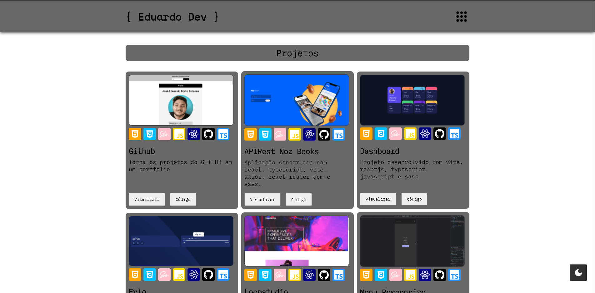
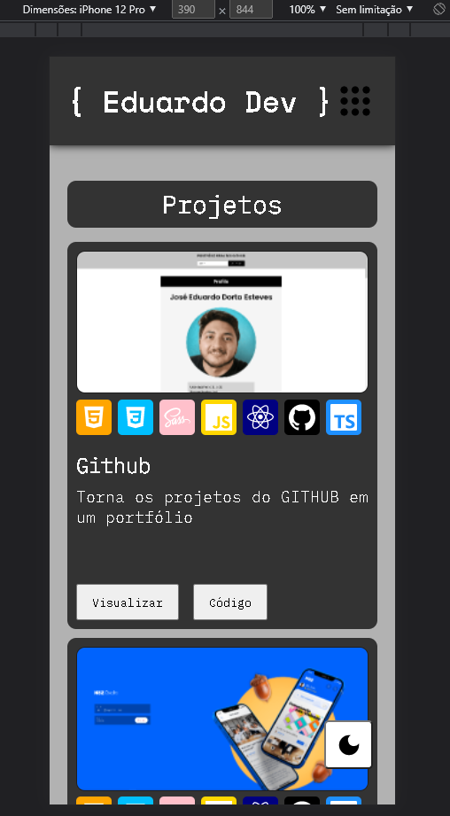

# Portfolio with ReactTS 🔥🏆

Esse portfolio foi desenvolvido usando as seguintes skills:

    🔴 REACTJS
    🟠 TYPESCRIPT
    🟡 SASS
    🟢 VITE
    🔵 AXIOS
    🟣 CONTEXT API
    🟤 EMAILJS-DOM
    ⚫ REACT-ROUTER-DOM
    ⚪ REACT-ICONS

O projeto já está na versão 2, contudo, ainda é possível acessar a versão 1.

## Code 👨‍💻

    yarn create vite portfolio --template react-ts
    |
    yarn
    |
    yarn add sass
    |
    yarn add axios
    |
    yarn add react-router-dom
    |
    yarn add react-icons
    |
    yarn add emailjs-dom

## Layout Desktop 🍕

## Layout Mobile 🍟

Para terminar...
- [x] Context API com weather
- [x] Context API com pokemon
- [x] Context API com github v1
- [x] Acrescentar o nome do pokemon
- [x] Mudar icon do menu
- [x] Adicionar animação no menu
- [x] Testar borda nos cards e buttons
- [x] Colocar as informações dos projetos em um arquivo .json
- [x] Componente Cards sendo mostrados com .map()
- [x] Gap nas skills
- [x] Acrescentar skill axios, context api, mysql, react-router-dom, express
- [x] Padding no botão da descrição
- [x] Centralizar o texto do componente Weather
- [x] Aumentar o tamnanho do texto da bio
- [x] Acrescentar no componente Name > Front-end > Fullstack
- [ ] Testar personalizações
- [x] Ver como o componente ModeDark se comporta no modo mobile
- [x] Adicionar botão de versão 1
- [ ] Passar imagens no compressor png para reduzir o tamanho
- [x] Arrumar layout do Form
- [ ] Criar componente para mostrar a antiga e nova performance do site no google
- [ ] Mostrar as novidades no componente News
- [ ] Paginação pokemon
