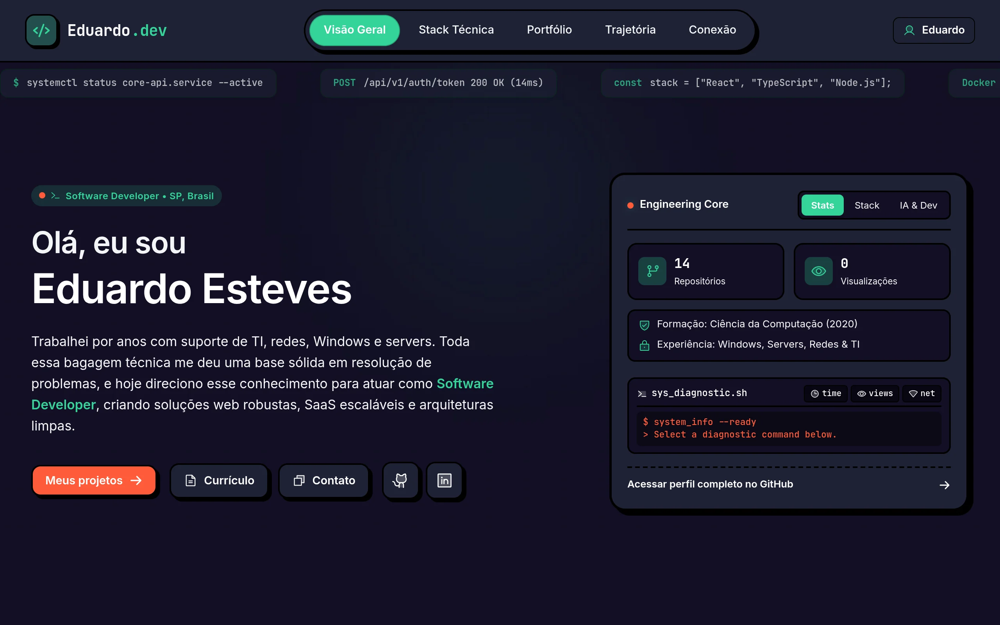
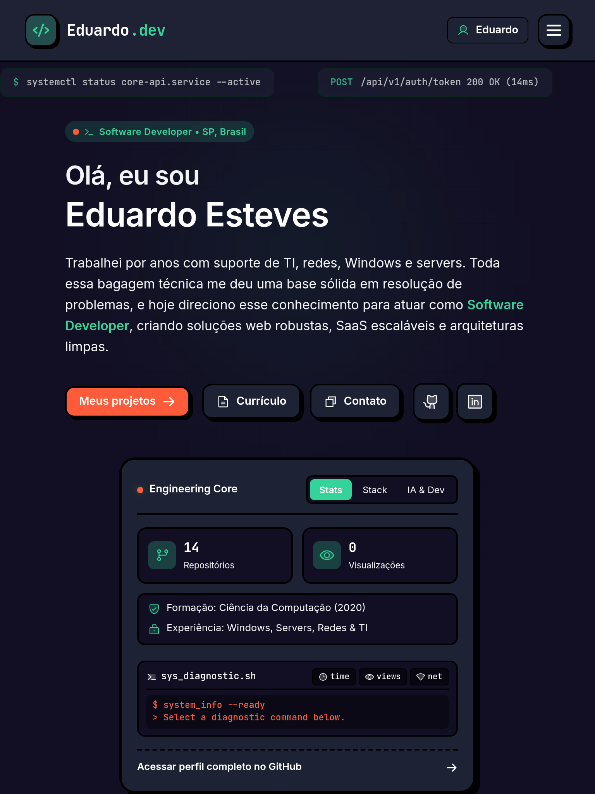
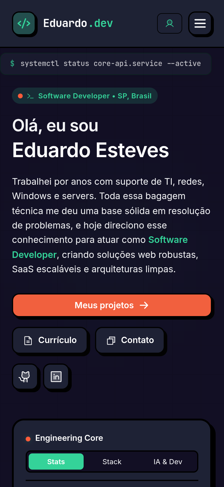

<div align="center">

# 🚀 Eduardo Esteves — Developer Portfolio

**A modern, responsive, and performance-driven portfolio showcase built with clean frontend architecture and advanced SCSS.**

[](https://opensource.org/licenses/MIT)
[](https://sass-lang.com/)
[](https://developer.mozilla.org/en-US/docs/Web/HTML)
[](https://developer.mozilla.org/en-US/docs/Web/JavaScript)
[](https://github.com/eduuesteves/portfolio/stargazers)
[](https://github.com/eduuesteves/portfolio/commits/main)

---

</div>

## 📖 Sobre / Visão Geral

Este repositório contém o código-fonte do **Portfolio Pessoal de Eduardo Esteves**, projetado para apresentar habilidades técnicas, trajetória profissional, projetos em destaque e canais de contato de forma clara, elegante e altamente performática.

A aplicação foi desenvolvida com foco em **Mobile-First Design**, **Arquitetura Modular CSS/SCSS** e **Semântica Web**, garantindo excelente tempo de carregamento, navegabilidade intuitiva e acessibilidade (a11y) em qualquer dispositivo.

### 🎯 Princípios Arquiteturais

- **Zero Bloatware:** Ausência de frameworks pesados desnecessários, priorizando CSS/SCSS puro e otimizações nativas de renderização.
- **Manutenibilidade:** Organização estilística inspirada em padrões como **BEM (Block Element Modifier)** e arquitetura modular de diretórios SCSS.
- **Acessibilidade & SEO:** Estrutura HTML5 semântica para indexação eficiente em motores de busca e leitores de tela.
- **Performance:** Recursos de mídia comprimidos e pipeline de build enxuto para pontuação elevada em auditorias Lighthouse.

---

## 🖼️ Demonstração / Screenshots Responsivas

A interface adapta-se dinamicamente a diferentes resoluções e densidades de tela, proporcionando uma experiência contínua e fluida.

### Desktop


### Tablet


### Mobile


---

## ✨ Recursos e Funcionalidades

- 📱 **Design 100% Responsivo:** Grid e layouts adaptáveis (Flexbox e CSS Grid) testados em múltiplas resoluções.
- 🎨 **Estilização com SCSS Avançado:**
  - Uso de variáveis, *mixins* reutilizáveis e funções customizadas.
  - Estruturação em partials modularizados para facilidade de manutenção.
- ⚡ **Alta Performance:** Execução rápida com taxa mínima de repintura (*repaint*) e reflow no navegador.
- ♿ **Acessibilidade (a11y):**
  - Contraste de cores validado.
  - Navegação fluida via teclado e suporte a leitores de tela.
- 💫 **Animações e Micro-interações:** Transições suaves em hover, scroll e estados interativos usando CSS Transitions e Animations.
- 📬 **Seção de Contato Direto:** Links diretos e integrados para e-mail, GitHub, LinkedIn e redes profissionais.

---

## 🛠️ Pré-requisitos e Guia de Instalação

Para executar e modificar este projeto localmente, você precisará ter as seguintes ferramentas instaladas em seu ambiente:

- [Node.js](https://nodejs.org/) (Versão 16.x ou superior)
- [NPM](https://www.npmjs.com/) ou [Yarn](https://yarnpkg.com/)
- [Git](https://git-scm.com/)

### Passo a Passo de Instalação

1. **Clone o repositório:**
   ```bash
   git clone https://github.com/eduuesteves/portfolio.git
   ```

2. **Acesse o diretório do projeto:**
   ```bash
   cd portfolio
   ```

3. **Instale as dependências do projeto:**
   ```bash
   npm install
   ```

4. **Inicie o servidor de desenvolvimento:**
   ```bash
   npm start
   ```
   *O projeto estará disponível no seu navegador no endereço `http://localhost:3000` (ou na porta indicada pelo terminal).*

---

## 🚀 Como Usar e Estrutura do Projeto

### Estrutura de Diretórios

```plain
portfolio/
├── src/
│   ├── assets/          # Imagens, ícones e fontes estáticas
│   ├── scss/            # Módulos e estilos Sass
│   │   ├── abstracts/   # Variáveis, mixins e funções
│   │   ├── base/        # Reset e tipografia global
│   │   ├── components/  # Botões, cards, modais
│   │   ├── layout/      # Header, footer, grid, navbar
│   │   └── main.scss    # Ponto de entrada do SCSS
│   ├── screenshot/      # Imagens de preview do README
│   └── index.html       # Estrutura HTML do projeto
├── package.json         # Scripts e dependências
└── README.md            # Documentação do projeto
```

### Comandos Disponíveis

- **Executar ambiente de desenvolvimento (com Live Reload):**
  ```bash
  npm run dev
  ```

- **Compilar e minificar SCSS para Produção:**
  ```bash
  npm run build
  ```

- **Validar/Formatador de código (Linter):**
  ```bash
  npm run lint
  ```

### Customização de Temas e Cores

Para alterar as paletas de cores e fontes globais, modifique o arquivo de variáveis em `src/scss/abstracts/_variables.scss`:

```scss
// Exemplo de estilização das variáveis do tema
$primary-color: #0070f3;
$secondary-color: #1a1a1a;
$bg-color: #ffffff;
$text-color: #333333;
$font-main: 'Inter', sans-serif;
```

---

<div align="center">

Desenvolvido por **[Eduardo Esteves](https://github.com/eduuesteves)**.
Se este projeto te ajudou ou te inspirou, considere deixar uma ⭐️!

</div>